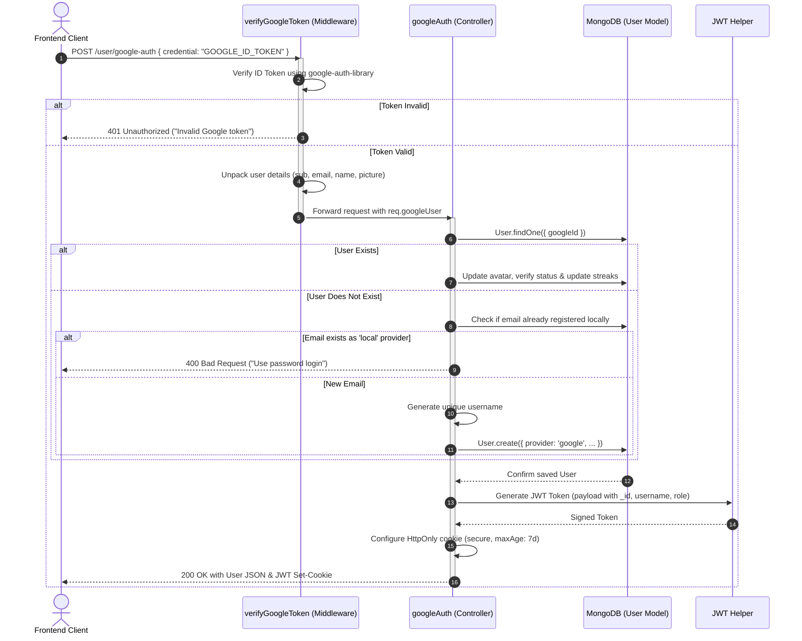
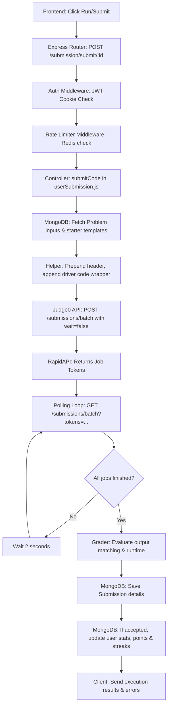
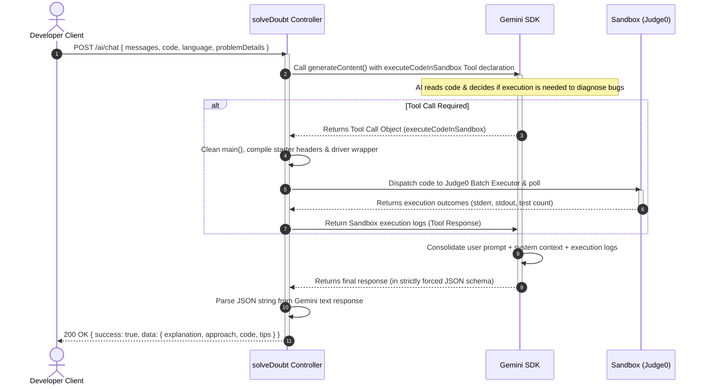

# CodeClimb Backend Workflow: Technical Reference Manual

Welcome! This document serves as a comprehensive, plain-English technical guide to the CodeClimb backend. It is designed to act as a review guide for system design walkthroughs, architecture discussions, and coding interviews. It breaks down the internal directory structure, end-to-end user request flows, database models, and performance optimizations.

---

## 1. Folder Architecture

The CodeClimb backend is structured using a clean, controller-to-model architecture with custom utilities. Code is located in the [src](file:///c:/CodeClimb/backend/src) directory:

```
backend/src/
├── config/             # Connection configurations (MongoDB, Redis)
├── controllers/        # Core business and request orchestration logic
├── middleware/         # Custom request filters, security guards, and rate limiters
├── models/             # Mongoose schemas defines database collections
├── routes/             # Express route mappings matching request URLs to controllers
└── utils/              # Standalone helpers (Judge0 executor, streaks, validations)
```

### Directory Roles & Context

*   **[config](file:///c:/CodeClimb/backend/src/config/)**: Establishes connections to third-party databases and message stores.
    *   [db.js](file:///c:/CodeClimb/backend/src/config/db.js): Sets up the Mongoose connection to MongoDB.
    *   [redis.js](file:///c:/CodeClimb/backend/src/config/redis.js): Bootstraps the Redis client connection for rate limiting and token blacklisting.
*   **[controllers](file:///c:/CodeClimb/backend/src/controllers/)**: The brains of the backend. They extract data from HTTP requests, interact with models or external APIs, and return JSON responses.
    *   [authController.js](file:///c:/CodeClimb/backend/src/controllers/authController.js): Coordinates login, logout, Google authentication, session checking, and admin controls.
    *   [problemController.js](file:///c:/CodeClimb/backend/src/controllers/problemController.js): Oversees challenge creation, listing, updating, deleting, liking, and bookmarking.
    *   [profileController.js](file:///c:/CodeClimb/backend/src/controllers/profileController.js): Handles profile detail retrieval and modifications.
    *   [solveDoubt.js](file:///c:/CodeClimb/backend/src/controllers/solveDoubt.js): Runs the AI DSA tutor agent logic, driving interactive doubt solving and running sandbox tests using the Gemini SDK.
    *   [userSubmission.js](file:///c:/CodeClimb/backend/src/controllers/userSubmission.js): Packages user-written code, calls Judge0, processes results, and updates user stats.
    *   [videoSection.js](file:///c:/CodeClimb/backend/src/controllers/videoSection.js): Handles video solution signature generation, confirmation checks, and deletions.
*   **[middleware](file:///c:/CodeClimb/backend/src/middleware/)**: Functions that intercept requests before they reach the controllers.
    *   [auth.js](file:///c:/CodeClimb/backend/src/middleware/auth.js): Decodes JWT tokens from HttpOnly cookies, checks the Redis logout blacklist, and checks roles.
    *   [googleAuth.js](file:///c:/CodeClimb/backend/src/middleware/googleAuth.js): Verifies Google-issued ID tokens from the frontend.
    *   [rateLimiterMiddleware.js](file:///c:/CodeClimb/backend/src/middleware/rateLimiterMiddleware.js): Protects endpoints from abuse using Redis Sorted Sets.
    *   [validateResources.js](file:///c:/CodeClimb/backend/src/middleware/validateResources.js): Confirms a problem exists in the DB before proceeding.
*   **[models](file:///c:/CodeClimb/backend/src/models/)**: Declares schemas and validations for MongoDB collections.
    *   [user.js](file:///c:/CodeClimb/backend/src/models/user.js): Represents the user, their stats, points, streaks, solved problems, and bookmarked lists.
    *   [problem.js](file:///c:/CodeClimb/backend/src/models/problem.js): Defines coding challenges, test cases, starter code templates, and reference solutions.
    *   [submission.js](file:///c:/CodeClimb/backend/src/models/submission.js): Represents a user's code execution, runtime metrics, memory usage, and grading status.
    *   [solutionVideo.js](file:///c:/CodeClimb/backend/src/models/solutionVideo.js): Stores paths and thumbnails of user/admin video solutions.
*   **[routes](file:///c:/CodeClimb/backend/src/routes/)**: Exposes backend endpoints, applying rate limiters and authentication filters:
    *   Exposes endpoints via [admin.js](file:///c:/CodeClimb/backend/src/routes/admin.js), [aiChatting.js](file:///c:/CodeClimb/backend/src/routes/aiChatting.js), [problem.js](file:///c:/CodeClimb/backend/src/routes/problem.js), [profile.js](file:///c:/CodeClimb/backend/src/routes/profile.js), [submit.js](file:///c:/CodeClimb/backend/src/routes/submit.js), [userAuth.js](file:///c:/CodeClimb/backend/src/routes/userAuth.js), and [videoCreator.js](file:///c:/CodeClimb/backend/src/routes/videoCreator.js).
*   **[utils](file:///c:/CodeClimb/backend/src/utils/)**: General utility libraries:
    *   [judge0Helper.js](file:///c:/CodeClimb/backend/src/utils/judge0Helper.js): Handles batch submissions and polling loops for Judge0.
    *   [utils.js](file:///c:/CodeClimb/backend/src/utils/utils.js): Contains user streak updates and submission summary calculations.
    *   [validateDetails.js](file:///c:/CodeClimb/backend/src/utils/validateDetails.js): Custom schema assertions.
    *   [CustomError.js](file:///c:/CodeClimb/backend/src/utils/CustomError.js): Operational error wrapper.
    *   [isObject.js](file:///c:/CodeClimb/backend/src/utils/isObject.js): Type check helper.

> [!NOTE]
> **Note on Services Directory**: CodeClimb does not implement a dedicated `services` folder. Instead, it relies on a simplified Controller-to-Model flow and modular helper files to keep code navigation direct and prevent overhead.

---

## 2. End-to-End Feature Workflows

### Google Auth Login Flow

This flow allows users to sign in or register instantly using their Google accounts.



#### Step-by-Step Execution:
1.  **Frontend Request**: The client sends a Google ID Token (as `credential`) in the request body to `/user/google-auth`.
2.  **Token Verification Middleware**: [verifyGoogleToken](file:///c:/CodeClimb/backend/src/middleware/googleAuth.js#L5-L57) takes the ID token and verifies it using Google's official `google-auth-library`.
3.  **Payload Extraction**: The middleware extracts the user's Google ID (`sub`), verified email, display name, and avatar picture. It sets this to `req.googleUser` and calls `next()`.
4.  **Database Lookup**: In [googleAuth](file:///c:/CodeClimb/backend/src/controllers/authController.js#L221-L300), the backend queries MongoDB for a User matching the `googleId`.
5.  **Profile Update & Streak Check**: If found, the database record is updated with the latest Google profile picture. Streaks are updated (using [updateStreaks](file:///c:/CodeClimb/backend/src/utils/utils.js#L45-L71)) if they logged in on a consecutive calendar day.
6.  **Conflict & Auto-Registration**:
    *   If no matching Google ID is found but the email already exists in MongoDB under a `local` provider (traditional password login), the server rejects the request. This prevents account hijacking.
    *   If the email does not exist, a new user account is provisioned with `provider` set to `'google'`. A unique username is generated based on their email prefix.
7.  **JWT Signing & Cookie Response**: The controller signs a JWT using the secret key with a 7-day expiration. The token is appended to the response headers as an HttpOnly, Secure cookie (`token`), and the user data is returned in the response body.

##### Sample User Response JSON:
```json
{
  "success": true,
  "message": "Google authentication successful!",
  "user": {
    "_id": "64b1e4c8f1a8c9038df810ea",
    "username": "coder_dev",
    "fullName": "Jane Doe",
    "emailId": "jane.doe@gmail.com",
    "role": "user",
    "avatar": "https://lh3.googleusercontent.com/a/ALm5wu...",
    "provider": "google",
    "emailVerified": true,
    "totalProblemsSolved": 12,
    "points": 180,
    "streaks": {
      "current": 3,
      "longest": 5,
      "lastUpdated": "2026-06-28T14:00:00.000Z"
    }
  }
}
```

---

### Code Execution Workflow

This covers the system design for running test cases ("Run Code") or grading submissions ("Submit Code").



#### Step-by-Step Execution:
1.  **Request Dispatch**: The user clicks "Run" or "Submit". The frontend makes a POST request to `/submission/run/:id` (runs against visible test cases) or `/submission/submit/:id` (evaluates against hidden test cases).
2.  **Authentication & Rate Limiter Check**: The server runs token checks and hits the sliding window rate limiter, which allows up to 10 submissions/minute and 15 runs/minute per user.
3.  **Template Packaging**: In [submitCode](file:///c:/CodeClimb/backend/src/controllers/userSubmission.js#L19-L195), the system retrieves the coding challenge from MongoDB. It fetches the starter template, header imports, and main driver code. The helper [buildFullSourceCode](file:///c:/CodeClimb/backend/src/utils/judge0Helper.js#L19-L29) stitches them together around the user's submitted function:
    $$\text{Full Submission Code} = \text{starterHeader} + \text{userCode} + \text{driverMain}$$
4.  **Batch Dispatch**: The stitched code is grouped into batch objects (containing code, input data, and expected output). The server makes a POST request to Judge0's batch submission API (`/submissions/batch?wait=false`), which queues execution and immediately returns an array of transaction tokens.
5.  **Asynchronous Polling**: The controller passes the tokens to [submitToken](file:///c:/CodeClimb/backend/src/utils/judge0Helper.js#L74-L118). It enters a loop, sleeping for 2 seconds, and calls Judge0's batch status endpoint using `GET /submissions/batch?tokens=token1,token2,...`. It retries up to 15 times (maximum 30 seconds).
6.  **Grading & Results Processing**: When all status codes return completed (`status.id !== 1 && status.id !== 2`), the loop breaks. The controller iterates through the results. If any test case status is not `3` (Accepted), the controller flags the first failing test case (e.g. `tle`, `wrong`, `runtime-error`) and stops processing.
7.  **Scorekeeping & Database Sync**: If the submission is accepted:
    *   It checks if this user has solved this problem before.
    *   If this is their first time solving the problem, it awards points based on difficulty (Easy: 10, Medium: 20, Hard: 30, Super-Hard: 50).
    *   It updates the user's streaks using the calendar tracker.
    *   It updates the problem's overall acceptance rate.
8.  **Response**: The system returns the status details to the frontend.

##### Sample Code Execution Output JSON:
```json
{
  "accepted": true,
  "totalTestCases": 10,
  "testCasesPassed": 10,
  "runtime": 0.056,
  "memory": 3120,
  "status": "accepted",
  "pointsEarned": 20,
  "errorMessage": null
}
```

---

### AI Debugger (Doubt Solver) Workflow

The AI Debugger uses Gemini to analyze code, explain logic, and run a feedback loop.



#### Step-by-Step Execution:
1.  **Request Input**: The client sends the chat message history, current code editor contents, selected language, and problem metadata to the `/ai/chat` endpoint.
2.  **Tutor Agent Initialization**: The controller [solveDoubt](file:///c:/CodeClimb/backend/src/controllers/solveDoubt.js#L61-L246) instantiates the Google GenAI SDK and creates a system instruction prompt. This prompt establishes its role as a tutor, provides the problem details, and sets formatting rules.
3.  **Tool Declaration Registration**: The controller registers the `executeCodeInSandbox` function schema as an executable tool. This allows the AI model to request code runs when explaining errors.
4.  **Initial Model Inference**: The system calls Gemini (`gemini-3-flash-preview`). If the model needs to check the code, it returns a function call request for `executeCodeInSandbox` instead of a text response.
5.  **Executing the Code Sandbox**: The backend intercepts this tool request. It strips any duplicate `main` structures from the code parameter using [stripMain](file:///c:/CodeClimb/backend/src/controllers/solveDoubt.js#L38-L59) to prevent compiler issues. It matches the problem in MongoDB, wraps the user's code with the appropriate starters/drivers, sends it to Judge0, and polls for the result.
6.  **Context Resolution**: The execution logs (e.g. compile errors or input/output diffs) are formatted and returned to Gemini as a tool response.
7.  **Forced JSON Schema Output**: The backend calls Gemini again, passing the tool response. By specifying `responseMimeType: "application/json"` in the API request configuration, the system guarantees that the model output will fit the required structure.
8.  **Output Parsing**: The backend extracts and parses the JSON response, returning it to the frontend.

##### Sample AI Debugger Output JSON:
```json
{
  "success": true,
  "data": {
    "explanation": "Your code failed on test cases with negative numbers because your variable initialization set the minimum value to 0 instead of Integer.MIN_VALUE.",
    "approach": "1. Initialize the answer variable to negative infinity.\n2. Iterate through the array, updating the max if the current number is larger.",
    "code": "class Solution {\n    public int findMax(int[] nums) {\n        int max = Integer.MIN_VALUE;\n        for (int num : nums) {\n            if (num > max) max = num;\n        }\n        return max;\n    }\n}",
    "tips": [
      "Time Complexity: O(N) where N is array length.",
      "Consider arrays containing only negative elements as an edge case."
    ]
  }
}
```

---

### Database vs. Caching Workflow

Database query caching (e.g., caching problems or user submission histories) is not implemented in the backend. Instead, Redis handles session security and traffic control:

```
                  ┌──────────────────────────────────────────┐
                  │          Incoming client request         │
                  └────────────────────┬─────────────────────┘
                                       │
                                       ▼
                       [rateLimiterMiddleware check]
                                       │
                                       ▼
                     Is traffic within sliding limits? 
                       (Uses Redis ZSET operations)
                               /       \
                             No        Yes
                             /           \
                            ▼             ▼
                 [429 Too Many Requests]  [Verify JWT Token]
                                                 │
                                                 ▼
                                     Is token in Redis blacklist?
                                           /           \
                                         Yes            No
                                         /                \
                                        ▼                  ▼
                            [Token cleared: 401]     [Query MongoDB]
```

#### 1. JWT Session Blacklist (Logout Invalidation)
Traditional JWTs remain valid until they expire, even if a user logs out. To prevent token reuse, CodeClimb uses a Redis blacklist:
*   **On Logout**: The token is read from the client's cookie and decoded. The system inserts the token signature into Redis under the key `token:${token}` with the value `'Blocked'`.
*   **TTL Configuration**: To keep memory usage low, the Redis key is set to auto-expire at the exact UNIX epoch timestamp of the original JWT expiration date:
    $$\text{Key Expiry} = \text{jwtPayload.exp}$$
*   **On Authenticated Routes**: The authorization middleware [verifyToken](file:///c:/CodeClimb/backend/src/middleware/auth.js#L7-L46) queries Redis. If the key exists, the request is rejected, the client's cookie is cleared, and they are redirected to login.

#### 2. Sliding Window Rate Limiter
To prevent API abuse, CodeClimb uses a sliding window rate limiter backed by Redis Sorted Sets (ZSET):
*   **Unique Identifier**: Requests are tracked by user ID (if logged in) or IP address + User Agent string (if guest).
*   **Timestamp Cleanup**: On each request, old timestamps outside the sliding window are removed using `ZREMRANGEBYSCORE`.
*   **Request Counting**: The remaining requests in the sorted set are counted using `ZCARD`. If the count exceeds the threshold, the server returns a `429 Too Many Requests` error.
*   **Registering Requests**: If the count is within limits, a new entry is added to the set using `ZADD` with the current time as the score, and key expiration is refreshed.

---

### Media Storage (Video Solutions) Workflow

To prevent blocking the Node.js event loop with large file uploads, CodeClimb uses Cloudinary signatures. This allows the client to upload files directly to Cloudinary:

```
┌────────┐                   ┌─────────┐                 ┌────────────┐
│ Client │                   │ Backend │                 │ Cloudinary │
└───┬────┘                   └───┬─────┘                 └─────┬──────┘
    │                            │                             │
    │ 1. GET signature           │                             │
    ├───────────────────────────>│                             │
    │                            │ 2. Check problem constraints│
    │                            │    & create HMAC signature  │
    │ 3. Return signature & URL  │                             │
    │<───────────────────────────┤                             │
    │                            │                             │
    │ 4. Direct Upload (POST file bytes)                       │
    ├─────────────────────────────────────────────────────────>│
    │                            │                             │
    │ 5. Returns public_id, url  │                             │
    │<─────────────────────────────────────────────────────────┤
    │                            │                             │
    │ 6. POST metadata confirmation                            │
    ├───────────────────────────>│                             │
    │                            │ 7. Query Cloudinary API     │
    │                            │    to verify file existence │
    │                            │ ├──────────────────────────>│
    │                            │ │                           │
    │                            │ │ 8. Returns resource data  │
    │                            │ |<──────────────────────────┤
    │                            │                             │
    │                            │ 9. Save Solutions model     │
    │                            │    with auto-cropped thumbs │
    │ 10. 201 Created            │                             │
    │<───────────────────────────┤                             │
```

#### Step-by-Step Execution:
1.  **Constraint Check**: The admin client calls `/video/upload/:problemId`. The backend [generateUploadSignature](file:///c:/CodeClimb/backend/src/controllers/videoSection.js#L13-L62) checks if a video solution already exists for the problem to enforce a one-video-per-problem limit.
2.  **Signature Generation**: The backend generates a unique storage path (`CodeClimb-solutions/{problemId}/{userId}_{timestamp}`) and signs the parameters using Cloudinary's secret key and the HMAC-SHA1 algorithm.
3.  **Direct Upload**: The frontend receives the signature and upload parameters. It posts the raw video file bytes directly to Cloudinary's servers. The Node.js application server does not process or pipe the file bytes.
4.  **Metadata Saving**: Once the upload completes, the frontend sends a POST request to `/video/save/:problemId` containing the metadata (`cloudinaryPublicId`, `secureUrl`, `duration`).
5.  **Server Verification**: The backend calls Cloudinary's administration API using the public ID to verify that the file exists and check its size and length.
6.  **Thumbnail Creation & MongoDB Save**: The backend uses Cloudinary URL transformations to generate a cropped thumbnail:
    ```
    Transformation options: width: 400, height: 225, crop: 'fill', quality: 'auto', start_offset: 'auto'
    ```
    It saves the [SolutionVideo](file:///c:/CodeClimb/backend/src/models/solutionVideo.js) record in MongoDB. If a duplicate video is found during this final check, the newly uploaded Cloudinary resource is deleted automatically using the Cloudinary SDK.

---

## 3. Database & State Models

CodeClimb uses Mongoose schemas to structure data in MongoDB. Below are descriptions and structural shapes of the four collections:

### 1. User Collection
The [User](file:///c:/CodeClimb/backend/src/models/user.js) model stores account information, game progress, and streaks. It has indexes on `points` and `totalProblemsSolved` to optimize leaderboard queries.

```json
{
  "_id": "65bfa780d1921a99ac003501",
  "fullName": "Piyush S",
  "username": "piyush1056",
  "emailId": "piyush1056@gmail.com",
  "role": "user",
  "provider": "local",
  "avatar": "https://lh3.googleusercontent.com/...",
  "emailVerified": true,
  "points": 450,
  "totalProblemsSolved": 15,
  "problemsSolved": [
    {
      "problemId": "65bfa891d1921a99ac00360a",
      "solvedAt": "2026-06-25T18:30:00.000Z",
      "language": "javascript",
      "pointsEarned": 20
    }
  ],
  "streaks": {
    "current": 4,
    "longest": 12,
    "lastUpdated": "2026-06-28T10:15:30.000Z"
  },
  "bookmarks": [
    {
      "name": "Graph Study",
      "problems": ["65bfa891d1921a99ac00360a"]
    }
  ],
  "favouriteProblems": ["65bfa891d1921a99ac00360a"],
  "likedProblems": ["65bfa891d1921a99ac00360a"]
}
```

---

### 2. Problem Collection
The [Problem](file:///c:/CodeClimb/backend/src/models/problem.js) model tracks coding challenges, starter templates, and test cases. It contains arrays for:
*   `visibleTestCases` (used for standard runner feedback)
*   `hiddenTestCases` (used for final grading)
*   `startCode` (starter template with imports, main header, and trailing helper structures)
*   `referenceSolution` (used to verify problem correctness when it is created or updated)

```json
{
  "_id": "65bfa891d1921a99ac00360a",
  "title": "Two Sum",
  "problemNo": 1,
  "description": "Given an array of integers... return indices of the two numbers that add up to target.",
  "difficulty": "easy",
  "tags": ["array", "hash-maps"],
  "acceptance": 48,
  "constraints": ["2 <= nums.length <= 10^4", "-10^9 <= nums[i] <= 10^9"],
  "companies": ["Google", "Amazon"],
  "examples": [
    {
      "input": "nums = [2,7,11,15], target = 9",
      "output": "[0,1]",
      "explanation": "Because nums[0] + nums[1] == 9, we return [0, 1]."
    }
  ],
  "visibleTestCases": [
    { "input": "[2,7,11,15]\n9", "output": "[0,1]" }
  ],
  "hiddenTestCases": [
    { "input": "[3,2,4]\n6", "output": "[1,2]" }
  ],
  "startCode": [
    {
      "language": "javascript",
      "headerCode": "",
      "initialCode": "class Solution {\n    twoSum(nums, target) {\n        \n    }\n}",
      "mainCode": "// Driver code..."
    }
  ],
  "referenceSolution": [
    {
      "language": "javascript",
      "completeCode": "class Solution {\n    twoSum(nums, target) {\n        // Hash map solution...\n    }\n}"
    }
  ],
  "problemCreator": "65bfa780d1921a99ac003501",
  "likes": 42
}
```

---

### 3. Submission Collection
The [Submission](file:///c:/CodeClimb/backend/src/models/submission.js) model stores code execution records. It uses index keys to speed up statistics lookups, recent user queries, and problem analysis.

```json
{
  "_id": "65bfabffd1921a99ac003a05",
  "userId": "65bfa780d1921a99ac003501",
  "problemId": "65bfa891d1921a99ac00360a",
  "code": "class Solution {\n    twoSum(nums, target) {\n ...",
  "language": "javascript",
  "status": "accepted",
  "runtime": 0.048,
  "memory": 2048,
  "errorMessage": "",
  "testCasesPassed": 10,
  "testCasesTotal": 10,
  "pointsEarned": 10
}
```

---

### 4. Video (SolutionVideo) Collection
The [SolutionVideo](file:///c:/CodeClimb/backend/src/models/solutionVideo.js) model connects coding challenges to video walk-throughs stored on Cloudinary.

```json
{
  "_id": "65bfac99d1921a99ac003b0c",
  "problemId": "65bfa891d1921a99ac00360a",
  "userId": "65bfa780d1921a99ac003501",
  "cloudinaryPublicId": "CodeClimb-solutions/65bfa891d1921a99ac00360a/65bfa780d1921a99ac003501_1707010000",
  "secureUrl": "https://res.cloudinary.com/.../video/upload/v1707010000/CodeClimb-solutions/...",
  "thumbnailUrl": "https://res.cloudinary.com/.../video/upload/w_400,h_225,c_fill,q_auto/v1707010000/...",
  "duration": 480,
  "title": "Two Sum Optimal Visual Approach"
}
```

---

## 4. Performance Tricks Implemented

To keep the application highly responsive under load, the backend implements several optimization strategies:

### 1. Concurrent I/O operations using `Promise.all`
Node.js runs on a single event loop. To prevent blocking while waiting for multiple asynchronous database reads or writes, CodeClimb uses concurrent operations:
*   **Startup Concurrency**: During boot in [index.js](file:///c:/CodeClimb/backend/src/index.js#L31-L44), MongoDB connection initialization and Redis socket connection run concurrently, speeding up server startup.
*   **Metadata Dashboards**: The admin dashboard stats endpoint in [admin.js](file:///c:/CodeClimb/backend/src/routes/admin.js#L11-L16) queries counts for users, problems, and submissions concurrently. This reduces database wait time from $T_1 + T_2 + T_3 + T_4$ to $\max(T_1, T_2, T_3, T_4)$.
*   **Social & Metrics Sync**: When a user likes or bookmarks a problem, the server concurrently updates the User document and increments the Problem counter:
    ```javascript
    await Promise.all([user.save(), problem.save()]);
    ```

### 2. Strategic Database Indexing
Mongoose schema index configurations optimize query performance for common read operations:
*   **User Collection**: Includes indexing on user points (`{ points: -1 }`) and solved counts (`{ totalProblemsSolved: -1 }`). This allows the database to retrieve leaderboard rankings in $O(\log N)$ time instead of scanning the entire collection in $O(N)$ time.
*   **Submission Collection**:
    *   `{ userId: 1, problemId: 1 }`: Optimizes queries that check if a user has solved a specific problem.
    *   `{ userId: 1, createdAt: -1 }`: Speeds up retrieval of the user's submission history page.
    *   `{ problemId: 1, status: 1 }`: Speeds up recalculation of a problem's acceptance rate.

### 3. Offloading Network and Disk Operations to Cloudinary
Processing video uploads on a Node.js server consumes significant CPU cycles and network bandwidth. By using signed URLs, the client uploads directly to Cloudinary. The backend only handles light JSON metadata requests, which saves bandwidth and prevents server slow-downs during large uploads.

### 4. Efficient Redis Session & Rate Management
Using Redis for tokens and rate limiting protects the primary database:
*   **No DB Queries for Blocklists**: Checking if a token is blocked during user authentication is done in-memory via Redis, preventing database roundtrips.
*   **High-speed ZSET Limits**: The sliding window rate limiter runs entirely in-memory. Inactive keys expire automatically, which helps keep Redis memory usage low.

### 5. Graceful Connection Shutdowns
When a termination signal (`SIGINT`) is received, the application runs cleanup hooks:
```javascript
process.on("SIGINT", async () => {
  await redisClient.quit();
  await mongoose.connection.close();
  process.exit(0);
});
```
This closes open database connections and Redis sockets, preventing connection leaks.
